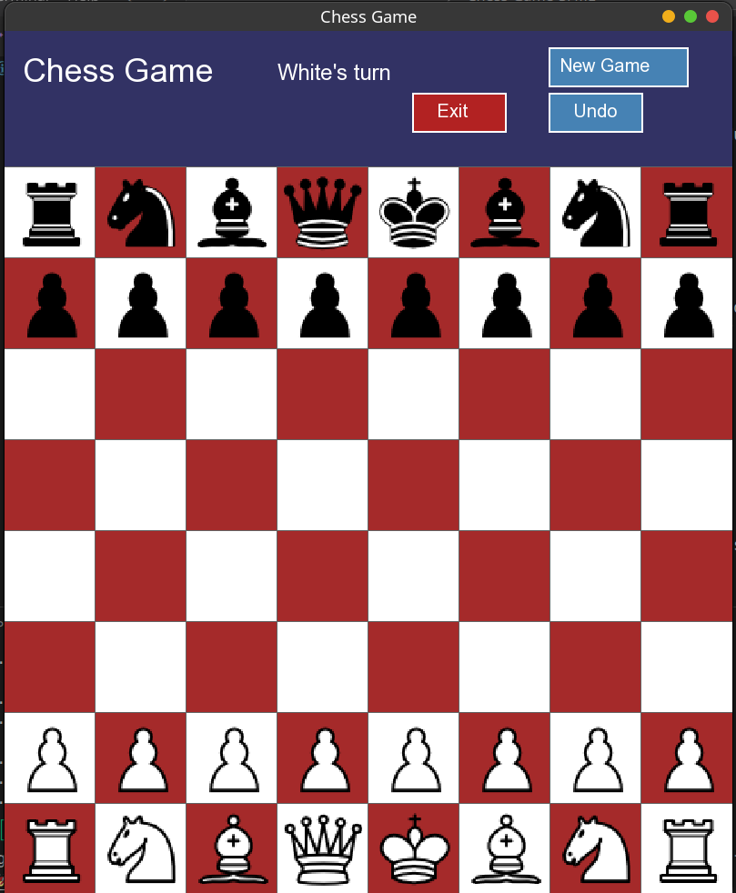

# Chess Game with SFML

A classic two-player chess game built using the SFML (Simple and Fast Multimedia Library) for the graphical interface.



---

## 📖 About The Project

This project is a fully playable, graphical chess game for two players on the same computer. It was developed in C++ and uses the SFML library to render the chessboard, pieces, and handle user input. The goal was to create a simple yet complete chess experience.

---

## ✨ Features

* **Graphical User Interface:** A visual chessboard and pieces.
* **Two-Player Mode:** Play against a friend on the same machine.
* **Move Highlighting:** Shows valid moves for selected pieces.
* **Standard Chess Rules:** Implements all the fundamental rules of chess.

---

## 📂 Project Structure

The repository is organized as follows:

```bash
.
├── assets/
│   ├── arial.ttf
│   ├── bb.png
│   ├── bk.png
│   ├── bn.png
│   ├── bp.png
│   ├── bq.png
│   ├── br.png
│   ├── EMPTY.png
│   ├── wb.png
│   ├── wk.png
│   ├── wn.png
│   ├── wp.png
│   ├── wq.png
│   └── wr.png
├── include/
│   └── game.hpp
├── src/
│   ├── game.cpp
│   └── main.cpp
└── Makefile
```

* `assets/`: Contains all the visual assets, including piece images (.png) and fonts (.ttf).
* `include/`: Header files (.hpp) for the project.
* `src/`: Source code files (.cpp) containing the game logic.
* `Makefile`: The build script to compile the project.

---

## 🚀 Getting Started

To get a local copy up and running, follow these simple steps.

### Prerequisites

You need to have `make` and a C++ compiler (like `g++`) installed, as well as the **SFML library**.

* **To install SFML on Debian/Ubuntu:**
    ```sh
    sudo apt-get update
    sudo apt-get install libsfml-dev
    ```

### Compilation & Execution

1.  **Clone the repository:**
    ```sh
    git clone <your-repo-url>
    cd Chess-Game-SFML
    ```

2.  **Compile the project using the Makefile:**
    ```sh
    make
    ```

3.  **Run the executable:**
    ```sh
    ./chess
    ```

---

## 🔧 Future Enhancements

Here are some ideas for future development:

* [ ] Implement an AI opponent (e.g., using the Minimax algorithm).
* [ ] Add sound effects for moves and checks.
* [ ] Introduce a networked multiplayer mode.
* [ ] Add a game timer.
* [ ] Implement castling, en passant, and pawn promotion.

---

## 🙏 Acknowledgements

* **SFML** - For the amazing multimedia library.
* **Assets** - Piece assets from [(https://www.clipartmax.com/)].

